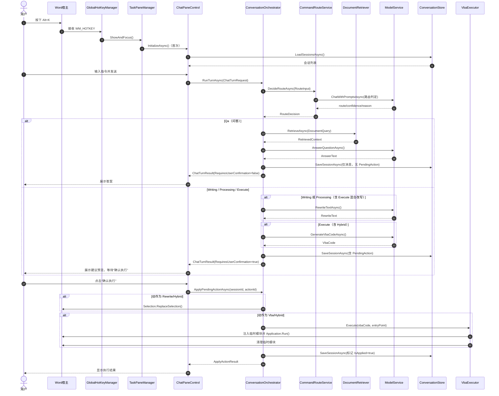

# SmartWord

SmartWord 是一个基于 VSTO 的 Word 插件（`.NET Framework 4.7.2`），目标是把自然语言指令转成可执行的文档操作。  
当前实现采用“先判定任务模式，再执行对应链路”的交互模式，支持文档问答、写作改写、结构化处理与执行操作（VBA/混合）。

## 项目现状

### 已实现能力

1. `Alt+K` 全局热键唤起右侧聊天面板。
2. 会话管理（新建会话、切换会话、历史消息展示、本地持久化）。
3. 路由决策（`Qa` / `Writing` / `Processing` / `Execute`）与模式锁定（自动、问答、写作、处理、执行）。
4. 检索增强（段落分块 + 关键词 + 向量相似度 + 可选重排），且仅在 `Qa`（问答）模式触发。
5. 先建议后执行（写作/处理/执行模式生成 `PendingAction`，用户点击“确认执行”后才修改文档）。
6. VBA 动态注入执行（临时模块注入、执行入口过程、执行后清理）。
7. 撤销分组（尽可能走 `UndoRecord`，失败时降级）。
8. OpenAI 兼容 API + 本地降级模型（`LocalModelService` / `LocalEmbeddingService`）。
9. 结构化日志（Serilog 文件滚动日志）。

### 已知限制

1. Ribbon 按钮点击事件在当前代码中未绑定，主入口实际是 `Alt+K`。
2. `dotnet build SmartWord.sln` 在未安装 Office VSTO targets 的环境下会失败（仅 Core/Services 可编译）。
3. 向量缓存重建采用锁内同步等待，超长文档场景下可能有等待感。
4. 向量缓存已支持按分块文本哈希做增量，但文档键与分块键仍有优化空间（见“检索与向量索引策略”）。

## 仓库结构

```text
SmartWord.sln
├─ SmartWord.Core/        # 领域契约、请求/响应模型、编排接口
├─ SmartWord.Services/    # 模型调用、检索、路由、存储、VBA执行、日志
└─ SmartWord.AddIn/       # VSTO入口、UI、热键、TaskPane、配置
```

关键目录说明：

- `SmartWord.AddIn/ThisAddIn.cs`：插件生命周期入口，负责依赖装配。
- `SmartWord.AddIn/UI/ChatPaneControl.cs`：侧栏主界面。
- `SmartWord.Services/Conversation/ConversationOrchestrator.cs`：会话主编排。
- `SmartWord.Services/Model/OpenAiApiOptions.cs`：配置加载与优先级合并。
- `SmartWord.Services/Vba/*`：VBA 代码净化、模块注入与执行。
- `SmartWord.Services/Storage/*`：会话与向量索引本地落盘。

## 核心执行链路

### 1) 启动阶段

`ThisAddIn_Startup` 完成以下初始化：

1. 加载运行配置（环境变量 + 本地配置文件）。
2. 初始化日志。
3. 创建选区服务、模型服务、向量服务、路由服务、检索服务、会话存储。
4. 组装 `ConversationOrchestrator`。
5. 初始化 `TaskPaneManager`。
6. 注册全局热键 `Alt+K`。

### 2) 用户发送消息

1. 侧栏提交 `ChatTurnRequest`。
2. 编排器读取当前选区文本（仅当存在真实选区时才带入；光标停留不算选区）。
3. 路由服务判定本轮走 `Qa` / `Writing` / `Processing` / `Execute`。
4. 若是 `Qa`：触发文档检索并直接生成答案（不生成待执行动作）。
5. 若是 `Writing` / `Processing` / `Execute`：生成待执行动作 `PendingAction`（改写文本和/或 VBA 代码），返回建议预览。
6. 将结果写入会话。

### 3) 用户确认执行

1. 点击“确认执行”触发 `ApplyPendingActionAsync`。
2. 若是改写：替换当前选区文本。
3. 若是 VBA：净化/校验代码，注入临时模块并执行入口过程。
4. 标记动作已执行，写回会话，支持后续追溯。

### 4) 时序图（Mermaid）



## 快速开始

### 1. 环境要求

- Windows（VSTO 插件运行环境）。
- Microsoft Word 桌面版（支持 COM/VBA）。
- Visual Studio 2022（建议安装 Office/SharePoint 开发相关组件）。
- .NET Framework 4.7.2 Targeting Pack。

VBA 执行相关建议：

1. 在 Word 信任中心启用“信任对 VBA 项目对象模型的访问”。
2. 若企业策略限制宏/VBA 项目访问，VBA 执行链路会失败。

### 2. 打开与调试

推荐方式（完整）：

1. 使用 Visual Studio 打开 `SmartWord.sln`。
2. 将 `SmartWord.AddIn` 设为启动项目。
3. `F5` 调试，Word 会随 AddIn 启动。

CLI 方式（仅验证 Core/Services）：

```powershell
dotnet build SmartWord.Core/SmartWord.Core.csproj
dotnet build SmartWord.Services/SmartWord.Services.csproj
```

说明：在当前机器执行 `dotnet build SmartWord.sln` 会报缺少 `Microsoft.VisualStudio.Tools.Office.targets`，这是 VSTO 工程常见依赖问题。

## 使用方式

1. 在 Word 中按 `Alt+K` 打开 SmartWord 侧栏。
2. 选择模式（自动/问答/写作/处理/执行）、模型（可选）和 Prompt 版本（可选）。
3. 输入自然语言指令并发送。
4. 若当前模式为问答：直接查看答案（不会修改文档）。
5. 若当前模式为写作/处理/执行：查看“建议预览”。
6. 点击“确认执行”应用到文档，或“取消”放弃本次动作。

## 配置说明

配置由 `OpenAiApiOptions.LoadFromEnvironment` 统一加载，优先级如下：

1. 环境变量
2. `runtime-settings.local.json`
3. 代码内默认值

### 1. 主要环境变量

| 变量名 | 说明 | 默认值 |
|---|---|---|
| `SMARTWORD_API_KEY` | Chat API Key（必需，除非走本地降级） | 空 |
| `SMARTWORD_API_BASE_URL` | Chat API 基地址 | `https://api.openai.com/v1` |
| `SMARTWORD_API_MODEL` | 默认聊天模型 | `gpt-4o-mini` |
| `SMARTWORD_PROMPTS_FILE` | Prompt 目录文件路径 | `Config/prompts.catalog.json` |
| `SMARTWORD_PROMPT_VERSION` | 默认 Prompt 版本 | `prompts.catalog.json` 的 `activeVersion` |
| `SMARTWORD_EMBEDDING_MODEL` | Embedding 模型 | `text-embedding-3-small` |
| `SMARTWORD_EMBEDDING_API_BASE_URL` | Embedding API 基地址 | 继承 `SMARTWORD_API_BASE_URL` |
| `SMARTWORD_EMBEDDING_API_KEY` | Embedding API Key | 继承 `SMARTWORD_API_KEY` |
| `SMARTWORD_CHAT_STORE_FILE` | 会话存储文件路径 | `Config/chat.sessions.local.json` |
| `SMARTWORD_VECTOR_INDEX_DIR` | 向量索引目录 | `Config/vector-index` |
| `SMARTWORD_SETTINGS_FILE` | 本地运行配置文件路径 | `Config/runtime-settings.local.json` |
| `SMARTWORD_LOG_LEVEL` | 日志级别 | `Information` |
| `SMARTWORD_LOG_DIR` | 日志目录 | `%LOCALAPPDATA%/SmartWord/Logs` |
| `SMARTWORD_LOG_RETAINED_FILES` | 日志保留文件数 | `14` |
| `SMARTWORD_LOG_FILE_SIZE_BYTES` | 单日志文件上限 | `10485760` |
| `SMARTWORD_LOG_DEBUG_SINK` | 是否输出到 Debug Sink | `false` |

兼容变量：

- `OPENAI_API_KEY`
- `OPENAI_BASE_URL`
- `OPENAI_MODEL`

### 2. 本地配置文件

模板文件：`SmartWord.AddIn/Config/runtime-settings.template.json`  
建议复制为本地文件并按需修改：

`SmartWord.AddIn/Config/runtime-settings.local.json`

示例：

```json
{
  "apiBaseUrl": "https://api.openai.com/v1",
  "apiKey": "sk-xxxx",
  "defaultModel": "gpt-4o-mini",
  "availableModels": ["gpt-4o-mini", "gpt-4.1-mini"],
  "promptCatalogPath": "Config/prompts.catalog.json",
  "defaultPromptVersion": "v1",
  "embeddingModel": "text-embedding-3-small",
  "embeddingApiBaseUrl": "",
  "embeddingApiKey": "",
  "chatStorePath": "Config/chat.sessions.local.json",
  "vectorIndexDirectory": "Config/vector-index"
}
```

### 3. Prompt 配置

Prompt 目录文件：`SmartWord.AddIn/Config/prompts.catalog.json`

结构要点：

1. `activeVersion`：默认启用版本。
2. `versions[]`：可配置多个版本。
3. 每个版本包含 `qa`、`writing`、`processing`、`execute` 四组模板（并兼容旧键 `rewrite` / `vba` 作为回退）。
4. 支持占位符：`{{question}}`、`{{instruction}}`、`{{selected_text}}`、`{{retrieved_context}}`、`{{entry_point}}`。

## 检索与向量索引策略

### 1. 何时触发检索

1. 仅当本轮模式判定为 `Qa`（问答）时，才触发文档检索。
2. `Writing` / `Processing` / `Execute` 默认不触发检索。
3. 自动模式下是否检索，取决于路由结果是否为 `Qa`。

### 2. 向量索引何时构建

1. 不在插件启动时预构建。
2. 在问答检索链路中按需构建/更新（懒加载）。
3. 本地索引落盘目录为 `Config/vector-index`（可通过配置覆盖）。

### 3. 是否支持“仅重建变化部分”

当前实现为“分块级增量 + 文档级换桶”：

1. 同一索引文件内：按 `chunkId + textHash` 判断是否重算向量，文本未变则复用缓存。
2. 分块删除：会清理索引中的陈旧分块，避免无限增长。
3. 限制：`DocumentId` 当前包含文档长度信息，文档长度变化可能导致切换到新索引文件，表现为一次性重建较多分块。
4. 限制：分块 ID 当前为段落序号（`p1/p2/...`），在文档前部插入/删除段落时，后续分块 ID 会连锁变化，影响增量命中率。

## 数据与日志落盘

- 会话文件：`Config/chat.sessions.local.json`
- 向量索引目录：`Config/vector-index`
- 日志目录：默认 `%LOCALAPPDATA%/SmartWord/Logs`
- 日志文件名：`smartword-YYYYMMDD.log`

## 开发建议

1. 分层职责保持清晰：`Core` 放契约，`Services` 放实现，`AddIn` 放宿主/UI。
2. 新功能优先接入 `ConversationOrchestrator` 主链路，避免新增并行入口。
3. 代码注释保持中文并强调“为什么”，不要重复代码字面意思。
4. 测试建议新增独立 `*.Tests` 项目，不在生产项目中写测试逻辑。
